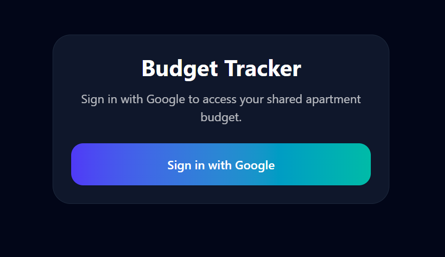
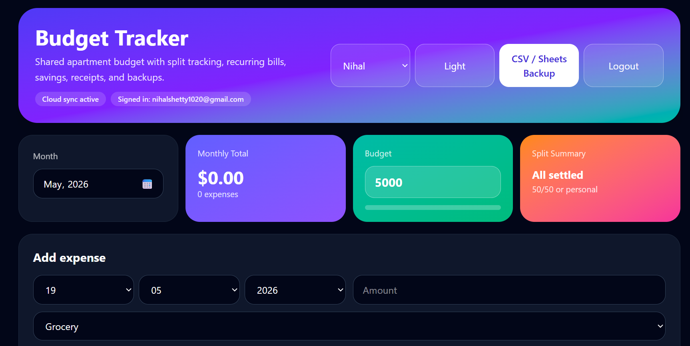
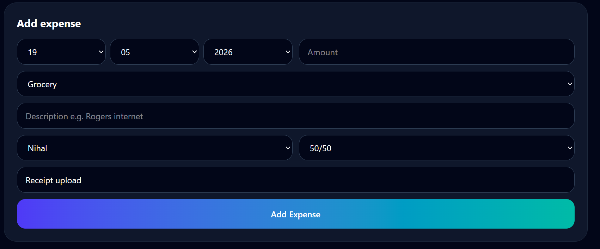
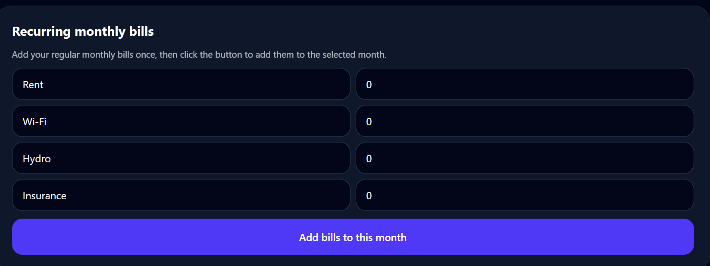
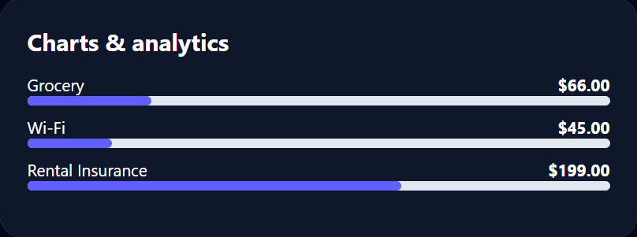

# Apartment Expense Tracker

A shared cloud-based apartment budgeting web application built using React and Firebase.

## Features

- Google Authentication
- Shared expense tracking
- Real-time cloud synchronization
- Recurring bill management
- CSV export
- Monthly expense summaries
- Mobile responsive design

## Tech Stack

- React
- Firebase Authentication
- Firestore Database
- Vite
- Vercel
- GitHub

## Live Demo

https://apartment-budget-tracker.vercel.app

## Application Screenshots

### Login Screen

### Dashboard Overview

### Add Expense Feature

### Monthly Bills

### Expense Analytics

---

## Demo Videos

### App Demo
[Watch Demo Video](./public/Screenshots/app-demo.mp4)

### Budget Overview Demo
[Watch Budget Overview](./public/Screenshots/budget-overview.mp4)

This application was built to simplify shared apartment expense management through secure cloud-based access and real-time synchronization between users.

## Key Functionalities

- Shared household budgeting
- Expense categorization
- Monthly recurring expenses
- Shared user access control
- Persistent cloud storage
- Responsive UI for desktop and mobile

## Security

- Firebase Authentication
- Authorized user-only access
- Protected Firestore security rules

## Future Improvements

- Expense analytics dashboard
- Charts and visual reporting
- Savings goals tracking
- Receipt uploads
- Notification reminders